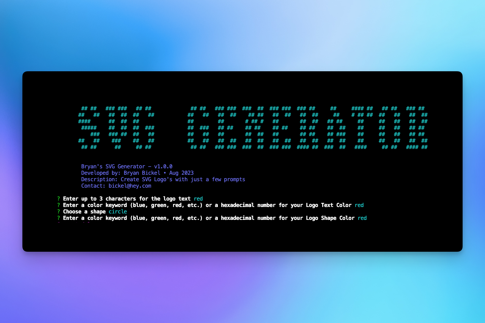

## User Story
`AS` a freelance web developer  
`I WANT` to generate a simple logo for my projects  
`SO THAT` I don't have to pay a graphic designer  

## Acceptance Criteria 
`GIVEN` a command-line application that accepts user input  
`WHEN` I am prompted for text  
`THEN` I can enter up to three characters  
`WHEN` I am prompted for the text color  
`THEN` I can enter a color keyword (OR a hexadecimal number)  
`WHEN` I am prompted for a shape  
`THEN` I am presented with a list of shapes to choose from: circle, triangle, and square  
`WHEN` I am prompted for the shape's color  
`THEN` I can enter a color keyword (OR a hexadecimal number)  
`WHEN` I have entered input for all the prompts  
`THEN` an SVG file is created named `logo.svg`  
`AND` the output text "Generated logo.svg" is printed in the command line  
`WHEN` I open the `logo.svg` file in a browser  
`THEN` I am shown a 300x200 pixel image that matches the criteria I entered  

## Overview
The goal of this project is to create an SVG Generator that runs in teh command line that dynamically generates an SVG logo from the the user's input. This project utilizes the Inquirer package and Jest for testing. 

A demo video walkthrough can be viewed [here](https://drive.google.com/file/d/1OdKkS4F_gK5xgbdeXQWw9YlVaSJwWT5-/view)

## Installation
To get started with the SVG generator, clone the respository. Then, enter the project directory and use your preferred package manager to install the necesarry dependencies. 

## Usage
After completing the installation, start the application and follow the prompts. 

## Technologies Used
* NPM
* Inquirer Package
* Prompt
* Chalk
* Jest

## Reflection 
This project has allowed me to apply the core skills I have recently learned and put them into practice. During development, I had the opportunity to deepen my understanding of NPM and creating tests with Jest. Additionally, I developed a deeper appreciation for for the importance code commenting, and the development principal DRY. (Don't repeat yourself). In the future, I would like to give users the ability to set their font-family. 

## Questions
If you have any questions or need further assistance, feel free to reach out to me: 
- **Email:** bickel@hey.com
- **GitHub:** [@briimcfly](https://github.com/briimcfly)

